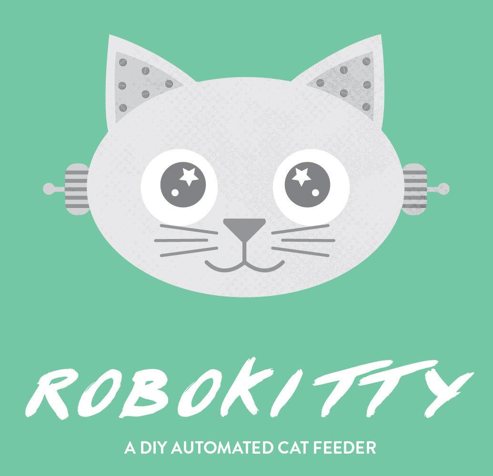
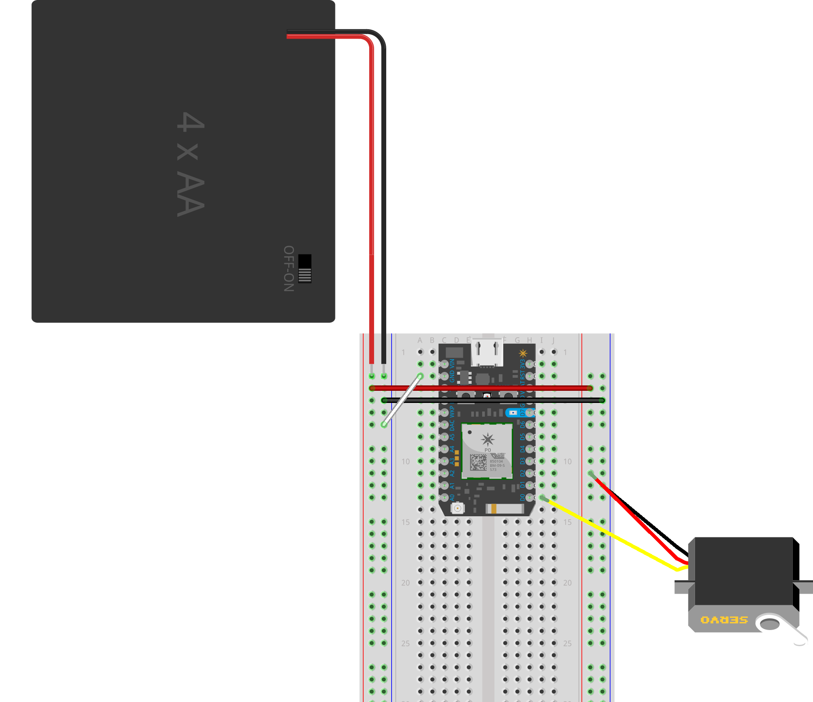

# robokitty
Is a DIY cat (or dog, I GUESS) feeder controlled over the web (locally for now) for less than $50.

There are two different feeding methods: feed instantly with the press of a button, or set up a CRON job to feed at hourly intervals.

The idea behind the project is over the past few years all of the feeders I've came across have had a level of complication that weren't very user-friendly to new coders, and I wanted to make something that is hopefully easy enough for everyone to use.

Let's get started!




## Part list

| Part  | Where to Buy / Price |
| ------------- | ------------- |
| Particle Photon Kit (comes with breadboard and USB cable, you can get just the board if you have these other items handy)  | [Particle.io / $29 / $19 for just the board](https://store.particle.io/)  |
| Male to Male jumper wires  | [Adafruit / $3.95 to $7.95 depending on length](http://www.adafruit.com/search?q=male+male+jumper&b=1)  |
| 4xAA Battery Pack with ON/OFF Switch  | [Adafruit / $2.95](https://www.adafruit.com/products/830)  |
| 4xAA Batteries  | Buy these wherever. $4 - 8  |
| 4xAA Battery Pack with ON/OFF Switch  | [Adafruit / $2.95](https://www.adafruit.com/products/830)  |
| Continuous Rotation Servo  | [Adafruit / $11.95](https://www.adafruit.com/products/154)  |
| 4xAA Battery Pack with ON/OFF Switch  | [Adafruit / $2.95](https://www.adafruit.com/products/830)  |
| Dry Goods Dispenser (last I checked I bought the last one... Sorry D:) | [Amazon / $24.99](http://www.amazon.com/gp/product/B00TECVEQE?psc=1&redirect=true&ref_=oh_aui_detailpage_o02_s00)  |
| USB Cube Charger (like for an iphone) | [Amazon / $8.29](http://www.amazon.com/Apple-Authentic-Adapter-iPhone-Touch/dp/B010NYA6VK/ref=sr_1_5?ie=UTF8&qid=1448330240&sr=8-5&keywords=usb+cube+charger)  |

*Additional Needs*
* Soldering Iron
* Solder
* Wire Strippers
* Heat Shrink Tube
* Method of attaching servo horn to feeder, details to follow.

## How-To

Once you have all of your materials handy, you're ready to start.

### Setting up your Particle Photon

A great guide can be found right on the Particle site [here](https://docs.particle.io/guide/getting-started/connect/photon/), but I will walk you through it! I'm going to assume you're doing this from scratch and don't have anything installed on your computer.

Make sure you've already set up an account and logged in on the Particle website before starting the tutorial.

First thing you need to do is power up the photon, plug in the cable and connect it to your computer.

Now you need to install Node, for sake of ease, go to the [Node site](https://nodejs.org/) and grab the latest version.

Once you've gotten Node installed, the next step differs depending on if you're using a Mac OS or Windows.

If you are on a Windows machine, please follow the steps called "Installing the Particle Driver" and "Opening the Command Prompt" which you can find [here](https://docs.particle.io/guide/getting-started/connect/photon/#installing-the-particle-driver).

If you are on a Mac, there are no additional steps to take before our next one.

It's time to install the Particle CLI (Command Line Interface)! 

### Particle CLI

Open up your CLI of choice, and type 
```
npm install -g particle-cli
```

Once it is done downloading, type 

```
particle cloud login
```

And answer the prompts with the login information you created earlier for the Particle site.


### Claiming a Photon

The Particle site has a thorough guide to claiming and setting up a photon [here](https://docs.particle.io/guide/getting-started/connect/photon/#connecting-your-device).


### Firmware
Now we need to flash the Photon with new Firmware. We're going to be using [VoodooSpark](https://github.com/voodootikigod/voodoospark).

If you have already claimed your photon correctly, you're going to need your photon id. Type the following, and keep track of what the number is because you'll need it shortly.

```
particle serial identify
```

The first thing you need after this is grab the latest version of the firmware from [here](https://github.com/voodootikigod/voodoospark/blob/master/firmware/voodoospark.cpp).

Save that file locally. I like to create a folder for all my github repositories usually in my Documents folder. Open up your command line interface and navigate to the folder that you want your working directory in. Once you have that folder open, type the following. 

```
mkdir robokitty
```

Change to that directory, put the firmware file that you downloaded into it. Next thing you need to do is flash the firmware, if you are connected to your photon you should be ready. Type the following.

```
particle cloud flash PARTICLE_DEVICE_ID voodoospark.cpp
```

Now you're ready to start working with the code for the feeder.

### Get ready with the code?

Clone this repo into your robokitty folder by typing the following:

```
git clone git@github.com:rachelnicole/robokitty.git
```

This is going to pull down all of the files into your robokitty directory, and create a new directory with the same name inside.

Navigate into the new robokitty folder, you're going to have to update your node modules.

```
npm update
```

This will pull down all of the dependencies you need.

The next step is to update the app.js file with your Photon's Token and Device ID. The Device ID is the same one that you had used in the previous firmware step. To get the access token, navigate to the [Particle Build Site](https://build.particle.io/).

Click on the settings link on the left, and copy the access token and add it to the appropriate line in your app.js file. 

Before we can actually run the code, we need to set up the hardware part.

### Talk about the hardware and wiring info

Wire up your photon according to this diagram.



The 4xAA battery pack wires need to be soldered to two of the MtoM wires that plug into the left rails of the breadboard. Cut off an end of each of the wires and solder the battery pack onto it. 

Now, you need to connect your servo to the dispenser handle. Do this the best way you see fit. It will work even with duct tape, or you can glue your servo horn to the handle (making sure you keep them parallel to each other so it doesn't break). Experiment with it so you find the best way that you see fit. I built a chassis for the servo out of cardboard and duct tape to support the servo while it's turning. You'll have to do the same. Do whatever you want! Acrylic, cardboard, or something else I haven't thought of.

Once you're all wired up, you're ready to run the code.

If you bought the same servo as me, you may have some tweaking to do which we will talk about in the next step.


### How to run 

In the command line, navigate into the main robokitty repository folder. Type the following:

```
node app.js
```

A browser window should now open up at [http://localhost:3000](http://localhost:3000).

You have two options, a button and a dropdown. 

The button is for instantaneous feeding, while the dropdown is for interval feeding. For the alpha release the dropdown is only going to work for that specific session while the page is open. I have added some feature requests to implement a better way of storing the session variables so even if you lose connection with your photon, it will remember. 

Push the button! 

The servo *should* turn and stop after 5 seconds. If it doesn't stop, you may need to tune your servo. If it has a trim pot, you can just turn until it stops. If it doesn't, you may need to open up the bottom of the servo and turn the little knob until it stops. If you can't figure it out, please feel free to open an issue and I will try and help you out as best as I can. I'm probably just as new to hardware as you are. :)


